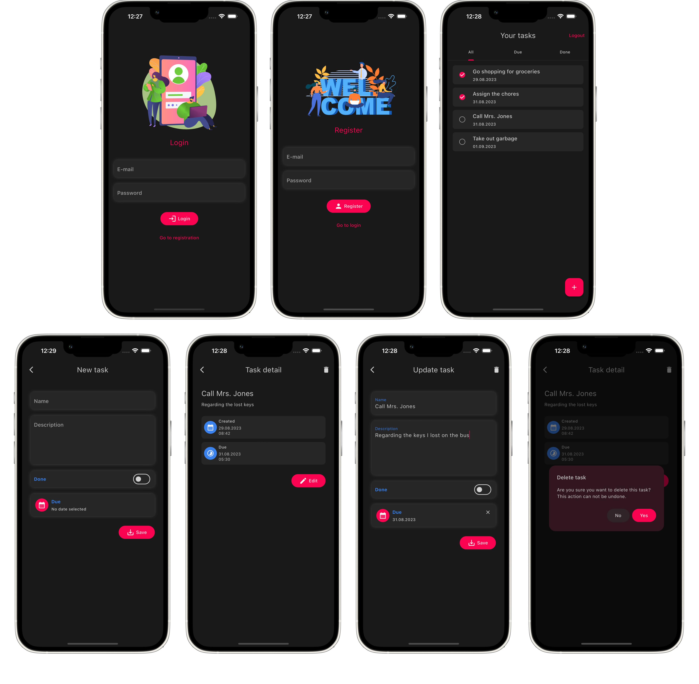

# Flutter Todo app
A simple todo list application, which uses firebase auth and firestore for storing users' tasks. This is just a simple project that I used for learning core basics of Flutter development (widgets, lifecycles, states, state management, themes, localization etc).

## Stack
* Dart
* Flutter
* Riverpod
* Firebase Authentication
* Firebase Cloud Firestore

## Screenshots
